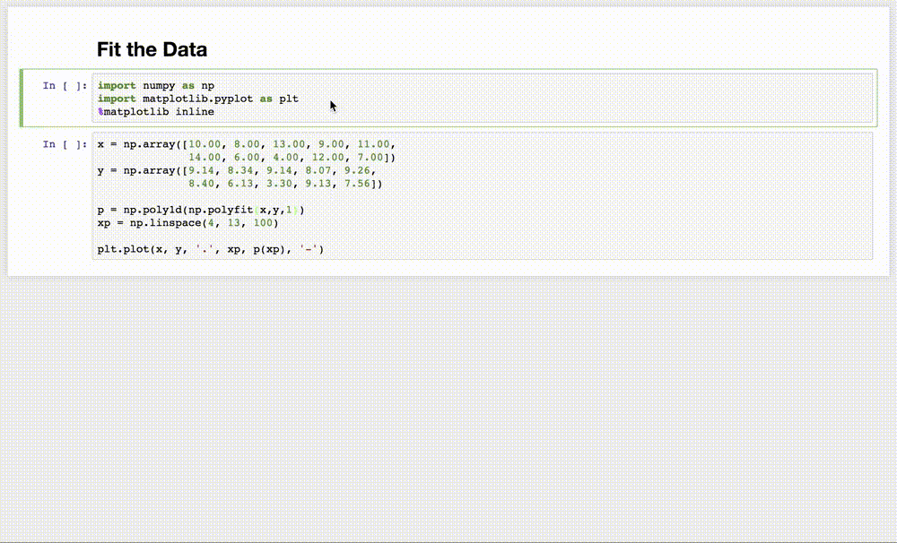

# Yarn

Yarn is a Jupyter Notebook extension that tracks an editable version history for
each cell. You can install Yarn cloning or downloading this repo and then
running the following two commands to install, and then enable Yarn. If you have
trouble, see these more [detailed instructions](
    https://jupyter-notebook.readthedocs.io/en/stable/extending/
    frontend_extensions.html)
about installing Jupyter extensions.

'''
jupyter nbextension install path/to/yarn/
jupyter nbextension enable path/to/yarn/main

'''

